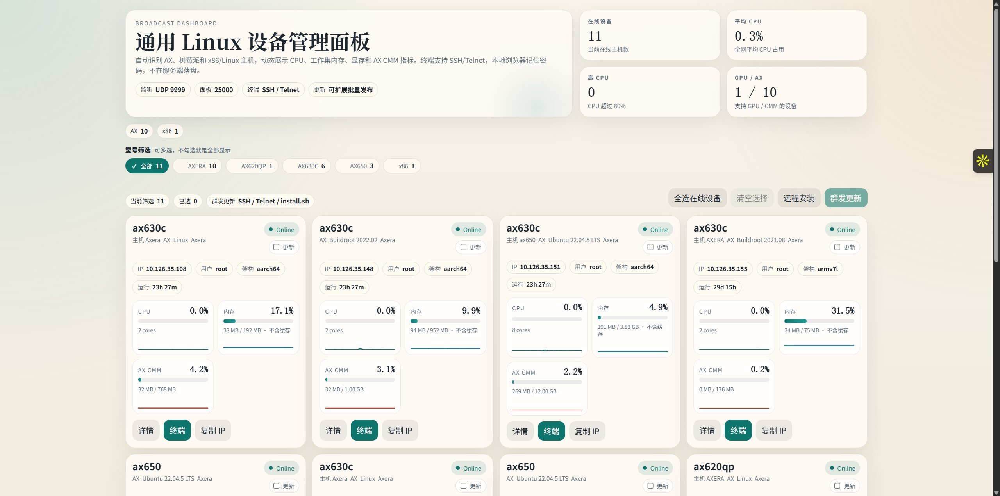
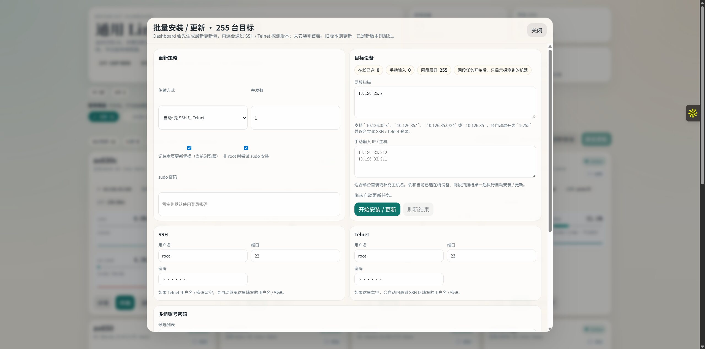
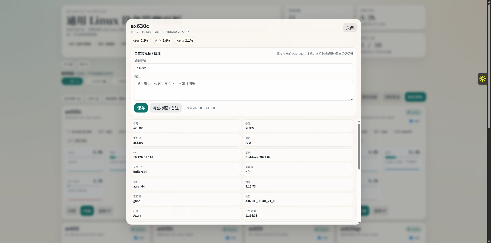
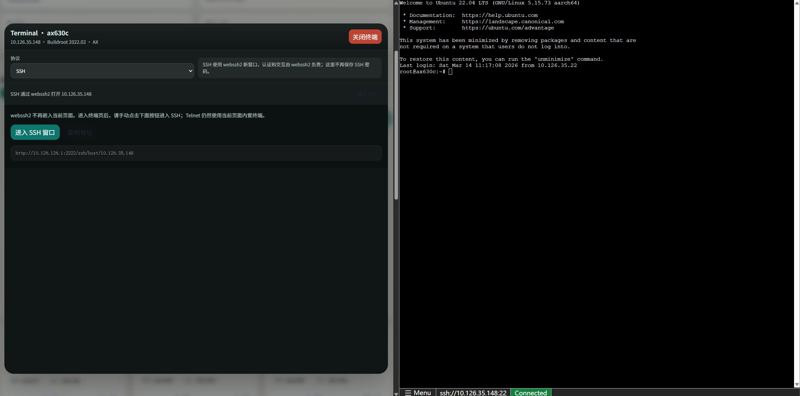

# 通用设备广播与监控面板

这个项目现在不再只面向 AX 设备，而是一个通用的 Linux 设备广播与管理方案：

- 自动识别 `AX / Raspberry Pi / x86 / 其他 ARM Linux`
- 自动上报 `OS 发行版 / 内核 / libc / 架构 / 用户 / 机型`
- 支持 `CPU / 内存 / 显存` 指标
- AX 设备额外支持 `UID / version / board_id / CMM`
- 仪表盘支持动态设备卡片、型号筛选、设备详情页、网页 SSH 终端
- SSH 终端支持浏览器本地保存密码，下次可直接进入
- 支持网页批量更新：可选 `SSH / Telnet / 自动 SSH->Telnet 回退`
- 支持远程安装网段扫描：可输入 `10.126.35.x / 10.126.35.0/24` 自动遍历 `1-255`
- 批量更新最终统一调用 `install.sh`，继续兼容 `systemd / init.d(S90) / rc.local / crontab / nohup`

## 页面预览

### 主页，设备筛选 / 信息卡片



- 页面顶部会汇总在线设备、平均 CPU、高 CPU 设备数、GPU / AX 设备数。
- 型号筛选支持按设备类型快速过滤，例如 `AX620Q / AX630C / AX650 / x86`。
- 设备信息卡片会展示在线状态、IP、默认用户、架构、运行时长，以及 `CPU / 内存 / GPU / AX CMM` 指标。
- 每张卡片都可以直接进入 `详情`、`终端`、`复制 IP`，并参与批量更新或远程安装。

### 批量安装 / 更新



- 批量更新支持三种目标来源同时混用：在线已选设备、手动输入 IP / 主机、网段扫描。
- 网段扫描支持 `10.126.35.x`、`10.126.35.*`、`10.126.35.0/24`、`10.126.35` 这几种写法。
- Dashboard 会先并发 `ping + SSH/Telnet 端口探测`，只在结果区展示探测到的机器，并显示扫描进度。
- 登录成功后会自动判断目标机版本：未安装则安装，版本过旧则更新，已是最新版本则跳过。
- 支持 `SSH`、`Telnet`、`自动 SSH 后 Telnet`，也支持多组账号密码按顺序重试。

### 设备详细信息页



- 详情页会集中展示设备的主机名、IP、系统版本、系统 ID、架构、内核、libc、厂商、机型、在线时间等信息。
- 页面顶部保留关键运行指标摘要，便于在查看元信息时继续判断设备状态。
- 支持直接编辑设备标题和备注，适合记录机位、负责人、用途、网络说明等内容。
- 标题和备注保存在当前 Dashboard 主机本地，服务重启后仍会保留。

### SSH：网页版 SSH（webssh2）



- SSH 页面默认通过 `webssh2` 新窗口打开，Dashboard 负责生成目标地址，不再在当前页直接承载 SSH 交互。
- `Telnet` 仍然使用 Dashboard 当前页面内置终端，适合没有 SSH 的设备。
- 如果需要这个网页版 SSH 能力，需要单独安装并运行一个 `webssh2` 服务。
- 本项目默认使用 `http://{dashboard_host}:2222/ssh/host/{host}` 作为跳转模板，可通过环境变量 `WEBSSH2_URL_TEMPLATE` 改掉。
- 如果暂时没有部署 `webssh2`，可把环境变量 `WEBSSH2_ENABLED=0`，SSH 会回退到当前页面内置终端。

## 依赖

```bash
pip install flask paramiko
```

## 编译

### 一次性编译所有本机支持的版本

```bash
./build.sh
```

编译产物会输出到 `dist/`，脚本会自动扫描 `PATH` 和常见工具链目录中的 `gcc/g++` 及交叉编译器，并自动匹配可编译的目标。

如果只想先看当前机器发现到了哪些编译器：

```bash
./build.sh --list-compilers
```

### 本地单独编译

```bash
g++ -std=c++11 -O2 -Wall -Wextra -o device_broadcast device_broadcast.cpp
```

## 安装设备端 Agent

```bash
sudo ./install.sh
```

安装脚本会自动：

- 获取当前安装用户，作为默认运行用户
- 如果本机能编译，则直接本地编译后安装
- 如果本机不能编译，则按 `arch + libc + device kind` 选择 `dist/` 中最合适的预编译包
- 优先使用 `systemd`
- 其次回退到 `init.d / rc.local / crontab`
- 再不行则自动 `nohup` 常驻

安装完成后会输出：

- 二进制路径
- 启动 runner 路径
- 日志路径
- 当前采用的常驻方式

## 启动 Dashboard

### 直接运行

```bash
python3 dashboard.py
```

默认地址：

```text
http://<dashboard-ip>:25000
```

如果要启用网页版 SSH，还需要额外准备一个可访问的 `webssh2` 服务；Dashboard 本身不会自动安装它，只负责跳转到 `WEBSSH2_URL_TEMPLATE` 指定的地址。

网页批量更新说明：

- 在页面中勾选多台设备后，可直接发起“群发更新”
- 远程安装界面支持输入网段，例如 `10.126.35.x`，Dashboard 会自动尝试登录该网段 `1-255` 主机
- Dashboard 会先在本机执行 `build.sh`，然后生成最新更新包
- 登录成功后会先探测目标机是否已安装 agent 以及已记录的包版本
- 未安装则自动安装；版本缺失或低于当前包版本则更新；已是新版本则跳过
- SSH 设备使用 `SFTP + install.sh`
- Telnet 设备会通过 `wget/curl/busybox wget/python` 从 Dashboard 拉取更新包，再执行 `install.sh`
- `install.sh` 仍会自动判断目标机是否能注册服务，不能时自动回退到 `nohup`

注意：

- SSH / Telnet / sudo 密码如勾选记住，只保存在当前浏览器的本地存储中，不会在服务端落盘
- Telnet 自动更新至少需要目标机具备 `curl / wget / busybox wget / python3 / python` 其中之一用于下载更新包

### 安装 Dashboard 为常驻服务

```bash
sudo ./install_dashboard_service.sh
```

兼容说明：

- 已经安装过老版本 `dashboard.service` 的机器，脚本会直接原地更新这个服务
- 已经安装过 `broadcast_dashboard.service` 的机器，脚本也会继续兼容
- 默认优先保留旧的 `dashboard.service` 名称，避免升级后所有机器都要重装服务

## 防火墙

Dashboard 主机至少要允许 UDP 9999：

```bash
sudo ufw allow 9999/udp
```

如果要远程访问网页，再额外放行 Dashboard 端口：

```bash
sudo ufw allow 25000/tcp
```

## SSH 终端密码保存

网页终端首次输入密码并勾选“记住密码”后，密码只会保存在当前打开网页的这台机器的当前浏览器本地存储里：

- 不会在 Dashboard 服务端落盘
- 其他电脑打开同一个 Dashboard 页面时拿不到这份密码
- 当前浏览器里可以直接清除本机保存的密码

注意：这是浏览器本地存储，不是服务端加密保险箱；如果同一台机器上的同一浏览器配置文件被别人使用，对方仍然可以复用本地保存的数据。
